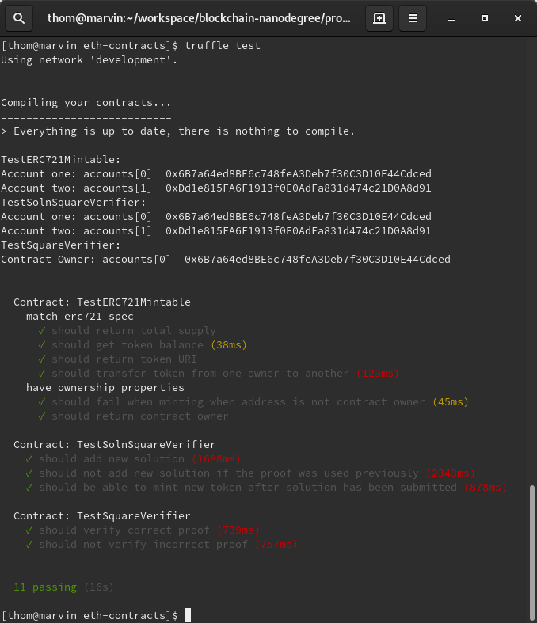
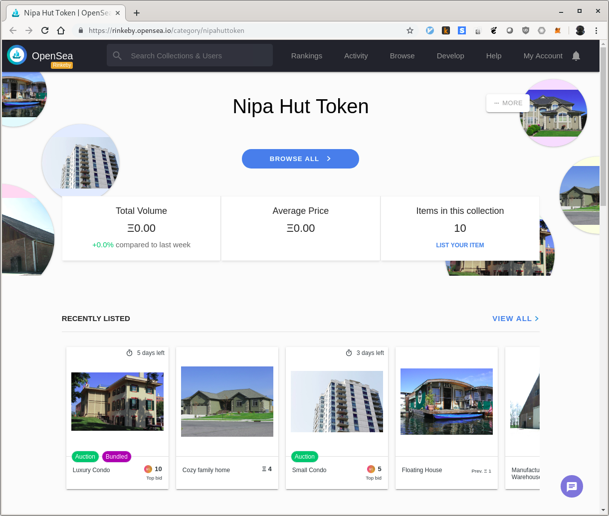

# Capstone: Real Estate Marketplace

The capstone will build upon the knowledge gained in the course in order to build a decentralized housing product.

## Getting Started

These instructions will get you a copy of the project up and running on your local machine for development and testing purposes.

### Prerequisites

Please make sure you've already installed ganache-cli, Truffle and enabled the MetaMask extension in your browser.

### Installing

A step by step series of examples that tell you have to get a development environment running.

Clone this repository and install all requisite npm packages (as listed in ```package.json```):

```
npm install
```

Change into the contracts folder:

```cd eth-contracts```

Launch Ganache:

```
ganache-cli -m "tattoo endless undo gold uniform deny era mean spot width execute impose"
```

In a separate terminal window, compile the smart contracts:

```
truffle compile
```

This will create the smart contract artifacts in folder ```build/contracts```.

Migrate smart contracts to the locally running blockchain, ganache-cli:

```
truffle migrate
```

Test the smart contracts:

```
truffle test
```

All 11 tests should pass and your terminal should look something like this:



## ZoKrates

The code repository already contains 10 pre-generated proofs that have been used to mint 10 tokens. The following instructions explain how the proofs have been generated.

* Step 1: Run Docker
  ```
  sudo systemctl start docker

  # In case SELinux prevents access to the local drive
  sudo su -c "setenforce 0"
  ```

* Step 2: Run ZoKrates
  ```
  docker run -v `pwd`/zokrates/code/:/home/zokrates/code -ti zokrates/zokrates /bin/bash
  ```

  Change into the square directory
  ``` 
  cd code/square/
  ``` 

* Step 3: Compile the program written in ZoKrates DSL
  ``` 
  ~/zokrates compile -i square.code
  ``` 

* Step 4: Generate the trusted setup
  ``` 
  ~/zokrates setup
  ```

* Step 5: Compute witness
  ``` 
  ~/zokrates compute-witness -a 3 9
  ```

* Step 6: Generate proof
  ```
  ~/zokrates generate-proof
  ```

* Step 7: Export verifier
  ```  
  ~/zokrates export-verifier
  ```

Re-run steps 5 and 6 with different arguments, e.g. 2 4, to generate additional proofs for minting tokens.

## Deploy smart contracts on a public test network (Rinkeby)

Create the following files in the ```eth-contracts``` folder:
* ```.infura-key```: Your [Infura](https://infura.io/) key
* ```.mnemonic```: Your [MetaMask](https://metamask.io/) seed phrase (mnemonic)

Execute the following command deploy the contracts to Rinkeby:

```truffle migrate --network rinkeby --reset```

The smart contracts are deployed on the Ethereum Rinkeby test network:
* NipaHutERC721Token: [```0x255837801Cd69aEd704Da884aF5BC2e2E14013db```](https://rinkeby.etherscan.io/address/0x255837801Cd69aEd704Da884aF5BC2e2E14013db)
* SquareVerifier: [```0xB8a0dc165DECF0e5a28a5EB8F9b7e6605235eBD3```](https://rinkeby.etherscan.io/address/0xB8a0dc165DECF0e5a28a5EB8F9b7e6605235eBD3)
* SolnSquareVerifier: [```0xC74013ee20CeD12A2D531594D71585E22168b9e2```](https://rinkeby.etherscan.io/address/0xC74013ee20CeD12A2D531594D71585E22168b9e2)

## Minting tokens

Before tokens can be minted, a new solution for the given token ID needs to be submitted, e.g.:

```node submit-solution.js ../zokrates/code/square/proofs/5/proof.json 5```

Now the token can be minted, e.g.:

```node mint-token.js 5```

## Generate OpenSea marketplace

Use the [OpenSea Rinkeby environment](https://rinkeby.opensea.io/get-listed/step-two) to list the SolnSquareVerifier token (```0xC74013ee20CeD12A2D531594D71585E22168b9e2```).

After listing, the marketplace should look like this:



Check out the Nipa Hut Token assets on OpenSea: [https://rinkeby.opensea.io/category/nipahuttoken](https://rinkeby.opensea.io/category/nipahuttoken)

## Requirements

Graded according to the [Project Rubric](https://review.udacity.com/#!/rubrics/1712/view).

## Project Resources

* [Remix - Solidity IDE](https://remix.ethereum.org/)
* [Visual Studio Code](https://code.visualstudio.com/)
* [Truffle Framework](https://truffleframework.com/)
* [Ganache - One Click Blockchain](https://truffleframework.com/ganache)
* [Open Zeppelin ](https://openzeppelin.org/)
* [Interactive zero knowledge 3-colorability demonstration](http://web.mit.edu/~ezyang/Public/graph/svg.html)
* [Docker](https://docs.docker.com/install/)
* [ZoKrates](https://github.com/Zokrates/ZoKrates)

## Versions

* Truffle v5.0.18 (core: 5.0.18)
* Solidity - ^0.5.2 (solc-js)
* Node v10.15.3
* Web3.js v1.0.0-beta.37
